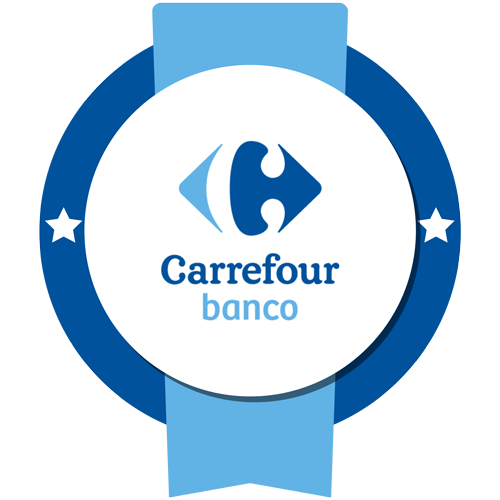
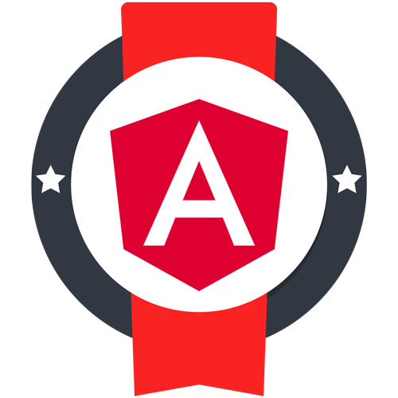

  

---

## 🧠 Sobre mim

Engenheiro de Software com **mais de 6 anos de experiência** construindo sistemas escaláveis, performáticos e orientados a valor de negócio.

Atuo de ponta a ponta: **backend em Java/Spring Boot**, **frontend em React e Angular** e **arquitetura cloud-native com microsserviços**. Em ambientes corporativos, participo de decisões de arquitetura e da construção de soluções que precisam sustentar carga real em produção.

## 🏗️ O que eu entrego

- **APIs escaláveis** para ambientes corporativos de alta demanda
- **Otimização de performance** em aplicações já em produção
- **Sistemas distribuídos** com mensageria (Kafka / RabbitMQ)
- **Decisões de arquitetura** com foco em manutenibilidade e custo

> 💡 *Substitua os itens acima por resultados com números — "reduzi p99 de X ms para Y ms", "API sustentando N req/s". Métricas concretas são o que diferencia um perfil sênior.*

## 🧰 Stack Tecnológica

## 🚀 Projetos em Destaque

### 🖥️ Allyson OS — simulação de sistema operacional no navegador

Um desktop completo rodando no browser: janelas interativas, aplicações internas (Sobre, Contato, Portfólio), integração com notícias em tempo real e contato direto via WhatsApp.

`React` · `TypeScript` · `APIs externas`

<!-- TODO: adicionar link do repositório e da demo ao vivo, além de um GIF da interface -->

## 📊 Atividade no GitHub

<!--
  Cards do github-readme-stats (estatísticas + top languages) removidos:
  a instância pública em github-readme-stats.vercel.app está com DEPLOYMENT_PAUSED
  e retorna 503, o que renderizaria imagens quebradas.
  Para reativar, faça um deploy próprio do projeto no Vercel
  (github.com/anuraghazra/github-readme-stats) e aponte para a sua instância.
-->

## 🎓 Certificações

## 🧠 Mentalidade de Engenharia

> "Eu não apenas escrevo código — eu projeto soluções que escalam, evoluem e geram valor."

---

⚡ *Criei uma simulação completa de sistema operacional rodando no navegador como portfólio.* 😄

